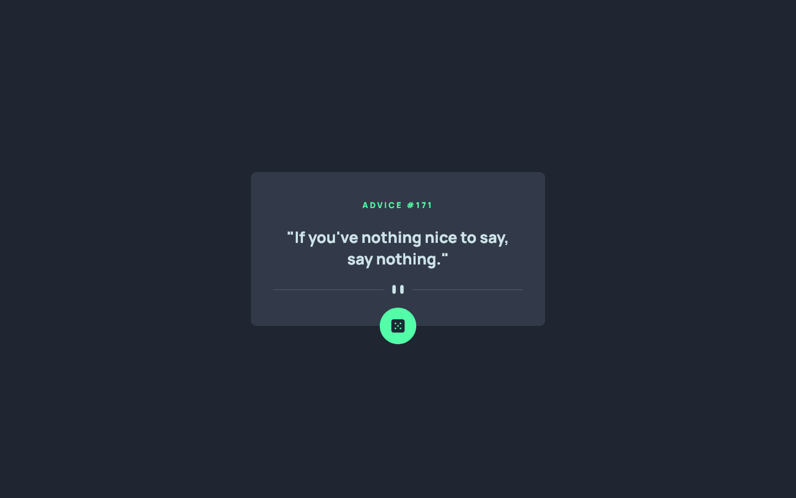

# Frontend Mentor - Advice generator app solution

This is a solution to the [Advice generator app challenge on Frontend Mentor](https://www.frontendmentor.io/challenges/advice-generator-app-QdUG-13db). Frontend Mentor challenges help you improve your coding skills by building realistic projects.

### The challenge

Users should be able to:

- View the optimal layout for the app depending on their device's screen size
- See hover states for all interactive elements on the page
- Generate a new piece of advice by clicking the dice icon

### Screenshot

### Links

- Solution URL: [GitHub](https://github.com/crackerFactory64/Frontend-Mentor-Projects/tree/main/advice-generator-app-main)
- Live Site URL: [GitHub Pages](https://crackerfactory64.github.io/fm-advice-app/)

## My process

### Built with

- Semantic HTML5 markup
- CSS custom properties
- Flexbox
- CSS Grid
- Mobile-first workflow
- BEM naming conventions
- [React](https://reactjs.org/) - JS library
- [FontAwesome](https://fontawesome.com) - icons
