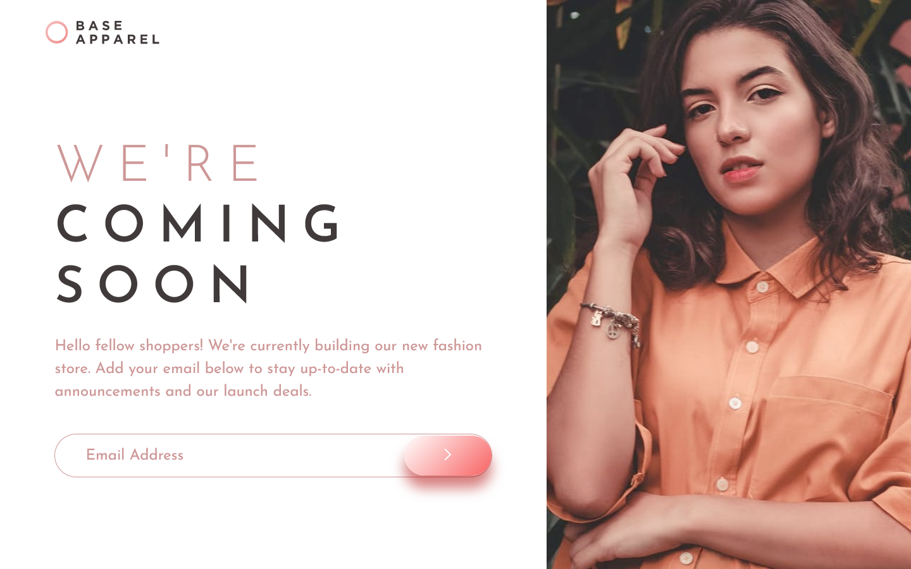

# Frontend Mentor - Base Apparel coming soon page solution

This is a solution to the [Base Apparel coming soon page challenge on Frontend Mentor](https://www.frontendmentor.io/challenges/base-apparel-coming-soon-page-5d46b47f8db8a7063f9331a0). Frontend Mentor challenges help you improve your coding skills by building realistic projects.

### The challenge

Users should be able to:

- View the optimal layout for the site depending on their device's screen size
- See hover states for all interactive elements on the page
- Receive an error message when the `form` is submitted if:
  - The `input` field is empty
  - The email address is not formatted correctly

### Screenshots

### Links

- Solution URL: [https://github.com/leemander/Frontend-Mentor-Projects/tree/main/base-apparel-coming-soon](https://github.com/leemander/Frontend-Mentor-Projects/tree/main/base-apparel-coming-soon)
- Live Site URL: [https://leemander.github.io/Frontend-Mentor-Projects/base-apparel-coming-soon/](https://leemander.github.io/Frontend-Mentor-Projects/base-apparel-coming-soon/)

## My process

### Built with

- Semantic HTML5 markup
- CSS custom properties
- Flexbox
- CSS Grid
- Mobile-first workflow
- BEM naming conventions
