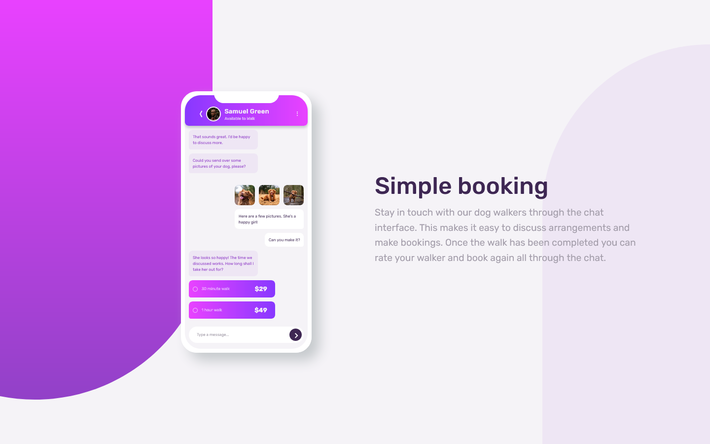
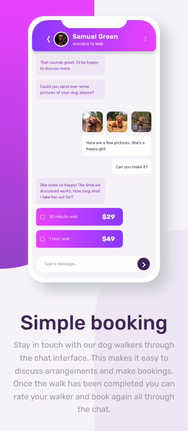

# Frontend Mentor - Chat app CSS illustration solution

This is a solution to the [Chat app CSS illustration challenge on Frontend Mentor](https://www.frontendmentor.io/challenges/chat-app-css-illustration-O5auMkFqY). Frontend Mentor challenges help you improve your coding skills by building realistic projects.

## Overview

### The challenge

Users should be able to:

- View the optimal layout for the component depending on their device's screen size
- **Bonus**: See the chat interface animate on the initial load

### Screenshot

### Links

- Solution URL: [GitHub](https://github.com/leemander/Frontend-Mentor-Projects/tree/main/chat-app-css-illustration-master)
- Live Site URL: [GitHub Pages](https://leemander.github.io/Frontend-Mentor-Projects/chat-app-css-illustration-master/)

## My process

### Built with

- Semantic HTML5 markup
- CSS custom properties
- CSS animations
- CSS Grid
- Mobile-first workflow
