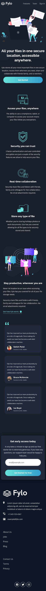
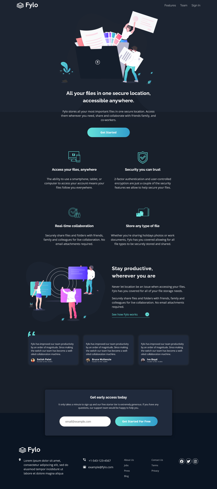

# Frontend Mentor - Fylo dark theme landing page solution

This is a solution to the [Fylo dark theme landing page challenge on Frontend Mentor](https://www.frontendmentor.io/challenges/fylo-dark-theme-landing-page-5ca5f2d21e82137ec91a50fd). Frontend Mentor challenges help you improve your coding skills by building realistic projects.

## Overview

### The challenge

Users should be able to:

- View the optimal layout for the site depending on their device's screen size
- See hover states for all interactive elements on the page

### Screenshot

### Links

-Solution URL: [https://github.com/leemander/Frontend-Mentor-Projects/tree/main/fylo-dark-theme-landing-page](https://github.com/leemander/Frontend-Mentor-Projects/tree/main/fylo-dark-theme-landing-page)

- Live Site URL: [https://leemander.github.io/Frontend-Mentor-Projects/fylo-dark-theme-landing-page/](https://leemander.github.io/Frontend-Mentor-Projects/fylo-dark-theme-landing-page/)

## My process

### Built with

- Semantic HTML5 markup
- CSS custom properties
- Flexbox
- CSS Grid
- Mobile-first workflow
- BEM naming conventions
- [FontAwesome](https://fontawesome.com/) - For icons
