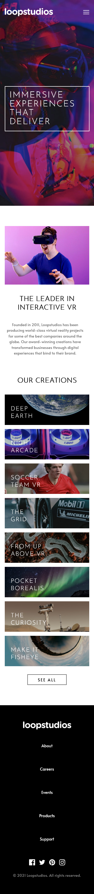
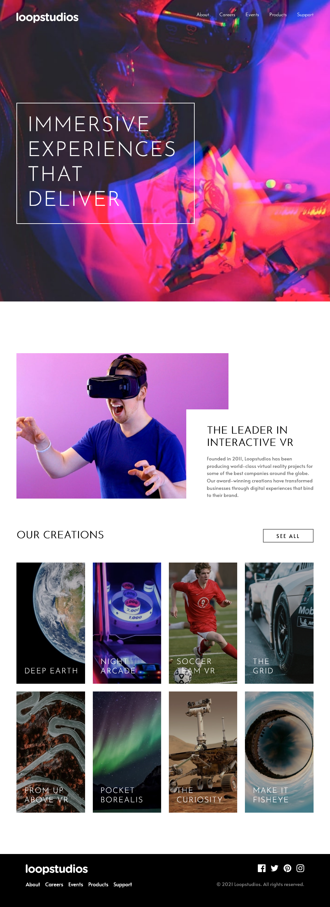

# Frontend Mentor - Loopstudios landing page solution

This is a solution to the [Loopstudios landing page challenge on Frontend Mentor](https://www.frontendmentor.io/challenges/loopstudios-landing-page-N88J5Onjw). Frontend Mentor challenges help you improve your coding skills by building realistic projects.

### The challenge

Users should be able to:

- View the optimal layout for the site depending on their device's screen size
- See hover states for all interactive elements on the page

### Screenshot

### Links

- Solution URL: [https://github.com/crackerFactory64/Frontend-Mentor-Projects/tree/main/loopstudios-landing-page-main](https://github.com/crackerFactory64/Frontend-Mentor-Projects/tree/main/loopstudios-landing-page-main)
- Live Site URL: [https://crackerfactory64.github.io/Frontend-Mentor-Projects/loopstudios-landing-page-main/](https://crackerfactory64.github.io/Frontend-Mentor-Projects/loopstudios-landing-page-main/)

## My process

### Built with

- Semantic HTML5 markup
- CSS custom properties
- Flexbox
- CSS Grid
- Mobile-first workflow
- BEM naming conventions
