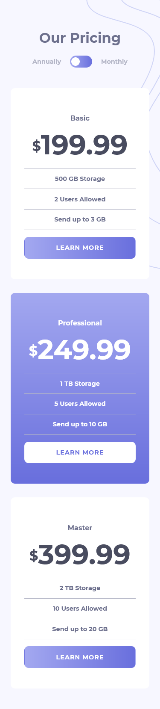
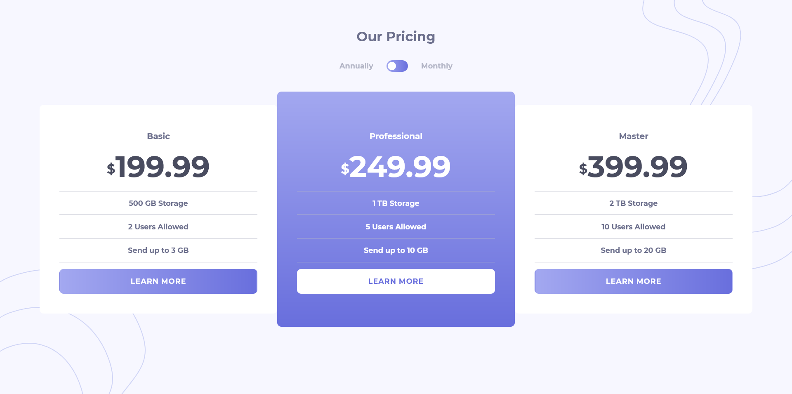

# Frontend Mentor - Pricing component with toggle solution

This is a solution to the [Pricing component with toggle challenge on Frontend Mentor](https://www.frontendmentor.io/challenges/pricing-component-with-toggle-8vPwRMIC). Frontend Mentor challenges help you improve your coding skills by building realistic projects.

### The challenge

Users should be able to:

- View the optimal layout for the component depending on their device's screen size
- Control the toggle with both their mouse/trackpad and their keyboard

### Screenshot

### Links

- Solution URL: [https://github.com/leemander/Frontend-Mentor-Projects/tree/main/pricing-component-with-toggle-master](https://github.com/leemander/Frontend-Mentor-Projects/tree/main/pricing-component-with-toggle-master)
- Live Site URL: [https://leemander.github.io/Frontend-Mentor-Projects/pricing-component-with-toggle-master/](https://leemander.github.io/Frontend-Mentor-Projects/pricing-component-with-toggle-master/)

## My process

### Built with

- Semantic HTML5 markup
- CSS custom properties
- Flexbox
- Mobile-first workflow
- BEM naming conventions
