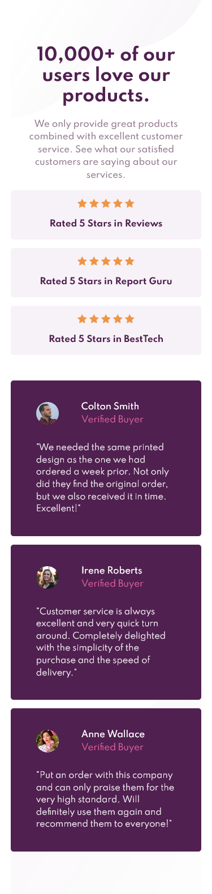
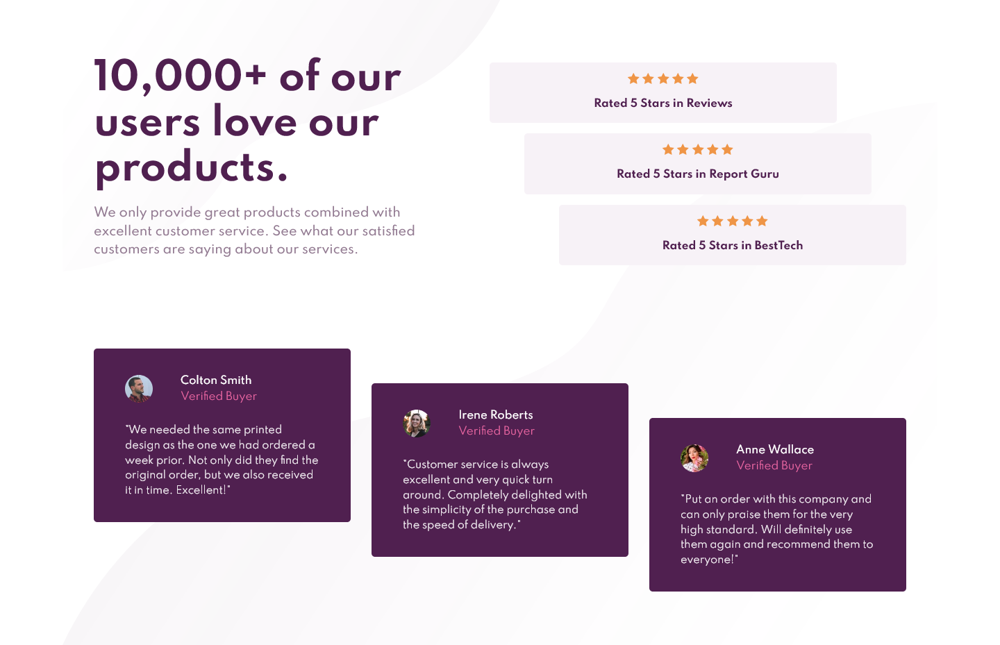

# Frontend Mentor - Social proof section solution

This is a solution to the [Social proof section challenge on Frontend Mentor](https://www.frontendmentor.io/challenges/social-proof-section-6e0qTv_bA). Frontend Mentor challenges help you improve your coding skills by building realistic projects.

### The challenge

Users should be able to:

- View the optimal layout for the section depending on their device's screen size

### Screenshot

### Links

- Solution URL: [https://github.com/crackerFactory64/Frontend-Mentor-Projects/tree/main/social-proof-section](https://github.com/crackerFactory64/Frontend-Mentor-Projects/tree/main/social-proof-section)
- Live Site URL: [https://crackerfactory64.github.io/Frontend-Mentor-Projects/social-proof-section/](https://crackerfactory64.github.io/Frontend-Mentor-Projects/social-proof-section/)

## My process

### Built with

- Semantic HTML5 markup
- CSS custom properties
- CSS Grid
- Mobile-first workflow
- BEM naming conventions
