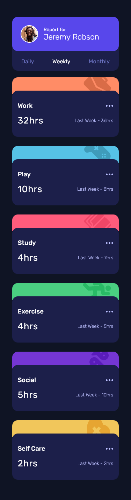
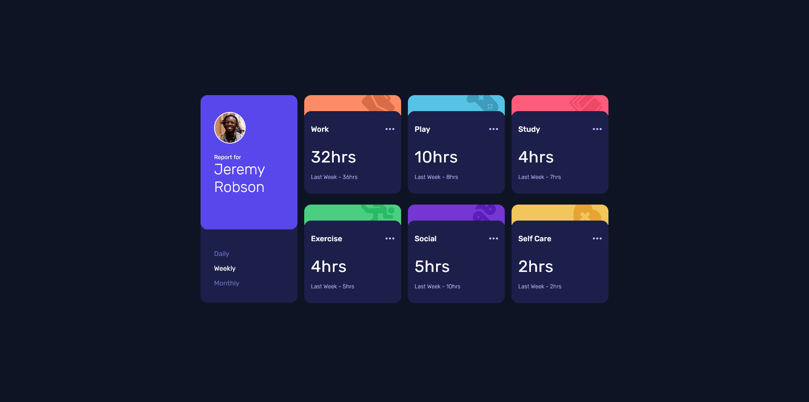

# Frontend Mentor - Time tracking dashboard solution

This is a solution to the [Time tracking dashboard challenge on Frontend Mentor](https://www.frontendmentor.io/challenges/time-tracking-dashboard-UIQ7167Jw). Frontend Mentor challenges help you improve your coding skills by building realistic projects.

## Overview

### The challenge

Users should be able to:

- View the optimal layout for the site depending on their device's screen size
- See hover states for all interactive elements on the page
- Switch between viewing Daily, Weekly, and Monthly stats

### Screenshot

### Links

- Solution URL: [https://github.com/leemander/Frontend-Mentor-Projects/tree/main/time-tracking-dashboard-main](https://github.com/leemander/Frontend-Mentor-Projects/tree/main/time-tracking-dashboard-main)
- Live Site URL: [https://leemander.github.io/Frontend-Mentor-Projects/time-tracking-dashboard-main/e](https://leemander.github.io/Frontend-Mentor-Projects/time-tracking-dashboard-main/)

## My process

### Built with

- Semantic HTML5 markup
- CSS custom properties
- Flexbox
- CSS Grid
- Mobile-first workflow
- BEM naming conventions
